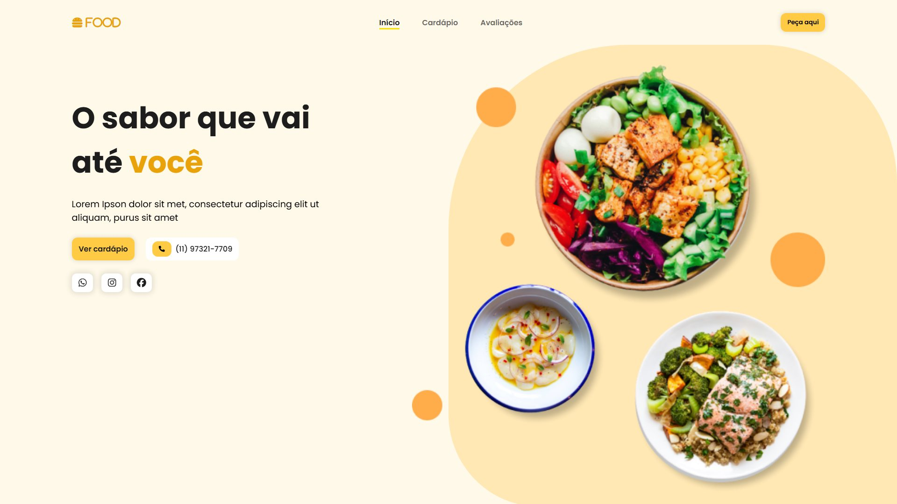

<div align="center">

# Empório Mais Sabor

Landing page responsiva com tema de restaurante: cardápio, depoimentos e seções institucionais com animações de rolagem suaves, construída com HTML, CSS modular e JavaScript.




**[Ver Projeto](https://otavio-2507.github.io/Emporio-Mais-Sabor/)**

</div>

## Visão geral

O Empório Mais Sabor apresenta a estrutura completa de uma landing page comercial para gastronomia: hero com chamada principal, vitrine de pratos, seção do chef, depoimentos de clientes e rodapé institucional. O CSS é organizado por seção (header, home, menu, depoimentos, footer), e as animações de entrada são orquestradas com ScrollReveal conforme o usuário navega pela página.

## Funcionalidades

- Layout responsivo para desktop, tablet e celular
- Animações de entrada por seção com ScrollReveal
- Cardápio com vitrine de pratos e destaques
- Seção de depoimentos de clientes
- Navegação suave entre as seções da página
- CSS modular, separado por seção da página

## Decisões de projeto

Algumas escolhas que não são óbvias pelo código:

**O laço de seções interrompe assim que acha a ativa.** O `return false` dentro do `.each` do jQuery é um `break`: encontrada a seção que contém a posição da rolagem, não faz sentido medir as restantes. Numa página de uma dobra só isso é detalhe; com muitas seções, é a diferença entre medir uma e medir todas a cada evento.

**Os depoimentos guardam os comentários em estrutura própria.** `commentsData` mapeia cada pessoa às suas avaliações, e o modal é montado a partir desse objeto em vez de ler o que já está na tela — o que permite mostrar no modal mais avaliações do que a página exibe no cartão resumido.

**Fechar o modal aceita os dois gestos que as pessoas tentam.** O clique é interceptado por delegação e vale tanto no botão de fechar quanto no fundo escurecido, com a verificação de alvo garantindo que clicar dentro do cartão não feche.

## Tecnologias

| Tecnologia | Aplicação no projeto |
| --- | --- |
| HTML5 | Estrutura semântica da landing page |
| CSS3 | Estilização modular por seção e responsividade |
| JavaScript | Interações da página |
| jQuery | Manipulação de DOM e eventos |
| ScrollReveal | Animações de entrada ao rolar |
| Font Awesome | Iconografia |

## Como executar

```bash
git clone https://github.com/OTAVIO-2507/Emporio-Mais-Sabor.git
cd Emporio-Mais-Sabor
```

Abra o arquivo `index.html` no navegador. As dependências são carregadas via CDN.

## Estrutura do projeto

```
Emporio-Mais-Sabor/
├── index.html              Página única da landing page
└── src/
    ├── javascript/
    │   └── script.js       Interações e animações
    ├── style/              CSS modular (header, home, menu, footer...)
    └── images/             Pratos, chef e identidade visual
```

## Referências

Projeto desenvolvido como estudo a partir do tutorial de Larissa Kich: [Como fazer uma Landing Page (YouTube)](https://www.youtube.com/watch?v=8V3mw1w6h0U).

